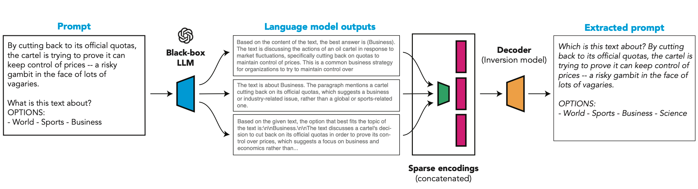

# CSE 517 Reproducibility Project: output2prompt

  
*Figure 1: Illustration of the output2prompt model.*

## Introduction

This repository contains the code for the CSE 517 Winter 2025 project. Our group members include Yongkang Li, Yicong Chen, and Shengqi Hang.

In this project, we reproduce the study from Zhang et al.[zhang-etal-2024-extracting], which trains a model, **output2prompt**, to extract both **user prompts** and **system prompts** from black-box language model outputs.

- **Paper:** [Extracting Prompts by Inverting LLM Outputs](https://arxiv.org/abs/2405.15012)  
- **Original Repository:** [GitHub: output2prompt](https://github.com/collinzrj/output2prompt)

## Requirements

To install the necessary dependencies and download the dataset and models, run:

```setup
# download the dataset and models
wget "https://zenodo.org/records/12759549/files/prompt2output_inverters.zip?download=1" -O prompt2output_inverters.zip
wget "https://zenodo.org/records/12759549/files/prompt2output_datasets.zip?download=1" -O prompt2output_datasets.zip
unzip prompt2output_inverters.zip
unzip prompt2output_datasets.zip
pip install .
```

## Troubleshooting

If you encounter issues while running the code, please ensure that your `transformers` library version is **4.36.0** and `accelerate` version is **0.28.0**. Using a newer version may cause compatibility issues.

## Pre-trained Models

Instead of training `output2prompt` from scratch, we fine-tune it using the **T5-base** model.

The pre-trained models can be found in the `inverters` folder after downloading and extracting the files.

## Reproducibility Efforts

For code related to **User Prompt** replications, please refer to `UserPromptCodebase`. 

For code related to **System Prompt** replications and the newly added experiments, please refer to `SystemPromptCodebase`.

## Reference

If you use this work, please cite the original paper:

```bibtex
@inproceedings{zhang-etal-2024-extracting,
    title = "Extracting Prompts by Inverting {LLM} Outputs",
    author = "Zhang, Collin  and
      Morris, John Xavier  and
      Shmatikov, Vitaly",
    booktitle = "Proceedings of the 2024 Conference on Empirical Methods in Natural Language Processing",
    month = nov,
    year = "2024",
    address = "Miami, Florida, USA",
    publisher = "Association for Computational Linguistics",
    url = "https://aclanthology.org/2024.emnlp-main.819/",
    doi = "10.18653/v1/2024.emnlp-main.819",
    pages = "14753--14777"
}
